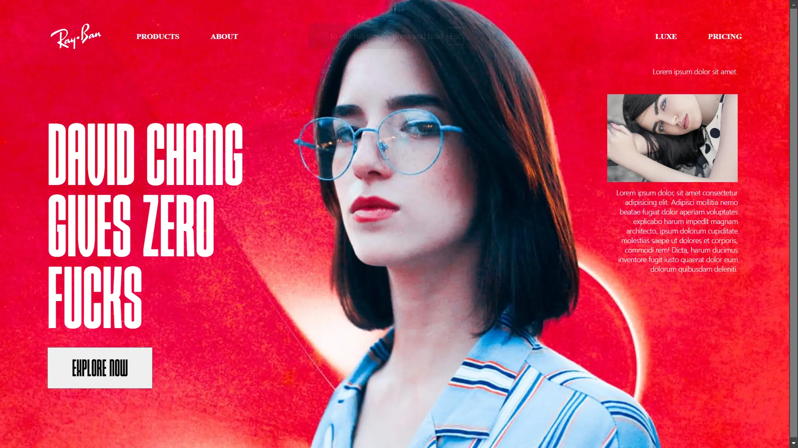

// //gsap for loader
// // Import GSAP library (ensure it's included in your project)
// const heading = document.getElementById("first");
// const textContent = heading.textContent;
// heading.textContent = ""; // Clear original content

// // Create individual  for each letter
// textContent.split("").forEach((letter) => {
//   const span = document.createElement("span");
//   span.textContent = letter;
//   span.style.opacity = "0"; // Initially hide the letters
//   heading.appendChild(span);
// });

// // Animate the letters
// gsap
//   .timeline()
//   .set("#first", { visibility: "visible" }) // Ensure the heading is visible
//   .to("#first span", {
//     opacity: 1, // Make each letter visible
//     y: 0, // Ensure no vertical movement
//     stagger: 0.05, // Time delay between letters
//     duration: 0.3, // Animation speed for each letter
//     ease: "power2.out", // Smooth easing effect
//   });

<!-- =============================================================================
  <!-- 

  <!-- Finisher Header Background -->
  

  <!-- Loading indicator - Removed as requested -->
  <!-- 

      
Loading...

  
 -->

  <section id="project-showcase" class="min-h-screen flex flex-col md:flex-row">
    <!-- Left Side: Project Cards -->
    

      <!-- Project Card 1 -->
      

        <a href="https://gooey-effect.vercel.app/" class="block">
          

            
          

          

            

              <h3 class="text-2xl font-bold mb-2 text-white/95 animate-fade-in">Gooey Effect</h3>
              
An interactive website featuring a trendy gooey effect
                showcasing various products with smooth animations and transitions.

              

                HTML
                CSS
                JavaScript
              

            

            

              View Project
              <svg class="w-4 h-4" fill="none" stroke="currentColor" viewBox="0 0 24 24">
                <path stroke-linecap="round" stroke-linejoin="round" stroke-width="2" d="M9 5l7 7-7 7"></path>
              </svg>
            

          

        </a>
      

      <!-- Project Card 2 -->
      

        <a href="https://halloween-two-rho.vercel.app/" class="block">
          

            
          

          

            

              <h3 class="text-2xl font-bold mb-2 text-white/95 animate-fade-in">Halloween Special</h3>
              
A spooky Halloween-themed website with interactive elements
                and animations. Perfect for the trick-or-treat season!

              

                HTML
                CSS
                JavaScript
              

            

            

              View Project
              <svg class="w-4 h-4" fill="none" stroke="currentColor" viewBox="0 0 24 24">
                <path stroke-linecap="round" stroke-linejoin="round" stroke-width="2" d="M9 5l7 7-7 7"></path>
              </svg>
            

          

        </a>
      

      <!-- Project Card 3 -->
      

        <a href="https://holi-parallax-by-nvs.vercel.app/" class="block">
          

            
          

          

            

              <h3 class="text-2xl font-bold mb-2 text-white/95 animate-fade-in">Holi Parallax</h3>
              
A beautiful parallax scrolling effect website showcasing the
                Holi festival. Built with HTML, CSS, and JavaScript using DOM manipulation.

              

                HTML
                CSS
                JavaScript
              

            

            

              View Project
              <svg class="w-4 h-4" fill="none" stroke="currentColor" viewBox="0 0 24 24">
                <path stroke-linecap="round" stroke-linejoin="round" stroke-width="2" d="M9 5l7 7-7 7"></path>
              </svg>
            

          

        </a>
      

      <!-- Project Card 4 (Huuman - Commented out) -->
      <!--
          

              <a href="https://huuman.vercel.app/" class="block">
                  

                      
                  

                  

                      

                          <h3 class="text-2xl font-bold mb-2 text-white/95 animate-fade-in">Huuman</h3>
                          
An urban fashion e-commerce platform showcasing trendy tees and street style. Features a modern design with smooth animations.

                          

                              HTML
                              CSS
                              JavaScript
                          

                      

                      

                          View Project
                          <svg class="w-4 h-4" fill="none" stroke="currentColor" viewBox="0 0 24 24">
                              <path stroke-linecap="round" stroke-linejoin="round" stroke-width="2" d="M9 5l7 7-7 7"></path>
                          </svg>
                      

                  

              </a>
          

          -->
    

    <!-- Right Side: Sticky 3D Model -->
    

      <canvas id="laptop-canvas" class="w-full h-full"></canvas>
    

  </section> -->

  <!-- ============================================================== -->
  
@tailwind base;
@tailwind components;
@tailwind utilities;

/* Custom styles if needed */
body {
    overflow-x: hidden; /* Prevent horizontal scroll */
    background-color: #f0f0f0; /* Example background */
}

/* Style for the fixed right side */
.sticky-right {
    position: sticky;
    top: 0;
    height: 100vh; /* Ensure it takes full viewport height */
}

/* Style for scrollable left side */
.scrollable-left {
    height: 100vh;
    overflow-y: auto;
}

/* Basic card styling */
.project-card {
    min-height: 70vh; /* Ensure cards are reasonably tall */
    margin-bottom: 20vh; /* Space between cards */
}

/* Responsive adjustments can go here */
@media (max-width: 768px) {
    .sticky-right {
        position: relative; /* Unstick on mobile */
        height: 50vh; /* Adjust height */
        order: 1; /* Move below cards */
    }
    .scrollable-left {
        height: auto; /* Adjust height */
        order: 2; /* Move above canvas */
    }
    .project-card {
        min-height: 50vh;
        margin-bottom: 10vh;
    }
    .main-container {
        flex-direction: column;
    }
} 

<!-- ================================================script  -->

// ===================================================

console.log("Script loaded");
// Three.js, GSAP, and ScrollTrigger logic will go here. 

import * as THREE from 'three';
import { OrbitControls } from 'three/addons/controls/OrbitControls.js';
import { EffectComposer } from 'three/addons/postprocessing/EffectComposer.js';
import { RenderPass } from 'three/addons/postprocessing/RenderPass.js';
import { UnrealBloomPass } from 'three/addons/postprocessing/UnrealBloomPass.js';

// Initialize GSAP ScrollTrigger
gsap.registerPlugin(ScrollTrigger);

// Scene setup
const scene = new THREE.Scene();
scene.background = null; // Ensure scene background is transparent

// Get the canvas element
const canvas = document.getElementById('laptop-canvas');

// Camera setup with proper aspect ratio based on canvas
const camera = new THREE.PerspectiveCamera(35, canvas.clientWidth / canvas.clientHeight, 0.1, 100);
camera.position.z = 5;
camera.lookAt(0, 0, 0);

// Renderer setup with proper canvas reference
const renderer = new THREE.WebGLRenderer({
    canvas: document.querySelector('#laptop-canvas'),
    antialias: true,
    alpha: true
});
renderer.setSize(window.innerWidth / 2, window.innerHeight);
renderer.setPixelRatio(Math.min(window.devicePixelRatio, 2));
renderer.shadowMap.enabled = true;
renderer.shadowMap.type = THREE.PCFSoftShadowMap;
renderer.setClearColor(0x000000, 0); // Set clear color to transparent
renderer.autoClear = false; // Ensure proper transparency

// Post-processing setup
const composer = new EffectComposer(renderer);
const renderPass = new RenderPass(scene, camera);
renderPass.clearColor = new THREE.Color(0x000000);
renderPass.clearAlpha = 0;
composer.addPass(renderPass);

const bloomPass = new UnrealBloomPass(
    new THREE.Vector2(canvas.clientWidth, canvas.clientHeight),
    1.5,  // Bloom intensity
    0.8,  // Bloom radius
    0.1   // Bloom threshold
);
composer.addPass(bloomPass);

// Lighting setup
const ambientLight = new THREE.AmbientLight(0xffffff, 1);
scene.add(ambientLight);

// Add directional light for better shadows
const directionalLight = new THREE.DirectionalLight(0xffffff, 0.8);
directionalLight.position.set(5, 5, 5);
scene.add(directionalLight);

// Variables for cylinder model
let cylinderModel;
let loadingManager;
let progressBar;
let isSectionVisible = false;
let targetRotation = Math.PI * 0.35; // Default 35% rotation (approximately 126 degrees)
let rotationSpeed = 0.03; // Slower for smoother rotation
let isMobile = window.innerWidth < 768;
let currentCardIndex = 0;

// Fixed rotation angles
const FIXED_X_ROTATION = 0.5; // Fixed X rotation in radians
const FIXED_Z_ROTATION = 0;   // Fixed Z rotation in radians

// Setup loading manager and progress bar
function setupLoadingManager() {
    loadingManager = new THREE.LoadingManager();
    progressBar = document.createElement('div');
    progressBar.className = 'fixed top-0 left-0 w-full h-1 bg-gray-200/30 backdrop-blur-sm';
    const progressIndicator = document.createElement('div');
    progressIndicator.className = 'h-full bg-green-600/80 transition-all duration-300';
    progressBar.appendChild(progressIndicator);
    document.body.appendChild(progressBar);

    loadingManager.onProgress = (url, itemsLoaded, itemsTotal) => {
        const progress = (itemsLoaded / itemsTotal) * 100;
        progressIndicator.style.width = `${progress}%`;
    };

    loadingManager.onLoad = () => {
        // Animate progress bar completion
        gsap.to(progressIndicator, {
            width: '100%',
            duration: 0.5,
            onComplete: () => {
                gsap.to(progressBar, {
                    opacity: 0,
                    duration: 0.5,
                    onComplete: () => progressBar.remove()
                });
            }
        });
    };
}

// Function to load the cylinder model
async function loadCylinderModel() {
    try {
        setupLoadingManager();

        // Create cylinder geometry - optimized for performance
        const geometry = new THREE.CylinderGeometry(1, 1, 1, 32, 32, true);
        
        // Load texture
        const textureLoader = new THREE.TextureLoader(loadingManager);
        const texture = await textureLoader.loadAsync('project.webp');
        
        // Create material with optimized settings
        const material = new THREE.MeshStandardMaterial({
            map: texture,
            transparent: true,
            side: THREE.DoubleSide,
            roughness: 0.2,
            metalness: 0.4,
        });
        
        // Create mesh with fixed rotation and default 35% rotation
        const mesh = new THREE.Mesh(geometry, material);
        mesh.rotation.set(FIXED_X_ROTATION, Math.PI * 0.35, FIXED_Z_ROTATION);
        
        // Add to scene
        scene.add(mesh);
        cylinderModel = mesh;
        
        // Remove loading indicator reference since it's been removed from HTML
        // document.getElementById('loading-indicator').style.display = 'none';
        
        // Add subtle floating animation
        gsap.to(cylinderModel.position, {
            y: '+=0.1',
            duration: 2,
            repeat: -1,
            yoyo: true,
            ease: 'power1.inOut'
        });
    } catch (error) {
        console.error('Error loading model:', error);
    }
}

// Load the model
loadCylinderModel();

// Animation loop - optimized with requestAnimationFrame
function animate() {
    requestAnimationFrame(animate);
    
    // Smooth rotation to target while maintaining fixed X and Z rotations
    if (cylinderModel) {
        const rotationDiff = targetRotation - cylinderModel.rotation.y;
        cylinderModel.rotation.y += rotationDiff * rotationSpeed;
        
        // Ensure X and Z rotations remain constant
        cylinderModel.rotation.x = FIXED_X_ROTATION;
        cylinderModel.rotation.z = FIXED_Z_ROTATION;
    }
    
    // Use composer.render() instead of renderer.render() to ensure transparency
    composer.render();
}

// Handle window resize - optimized for performance
let resizeTimeout;
window.addEventListener('resize', () => {
    // Debounce resize events
    clearTimeout(resizeTimeout);
    resizeTimeout = setTimeout(() => {
        // Update camera
        camera.aspect = canvas.clientWidth / canvas.clientHeight;
        camera.updateProjectionMatrix();

        // Update renderer and composer
        renderer.setSize(canvas.clientWidth, canvas.clientHeight);
        composer.setSize(canvas.clientWidth, canvas.clientHeight);
        
        // Check if device type changed
        const wasMobile = isMobile;
        isMobile = window.innerWidth < 768;
        
        // Adjust for mobile if needed
        if (wasMobile !== isMobile && cylinderModel) {
            if (isMobile) {
                // Mobile adjustments
                cylinderModel.scale.set(0.8, 0.8, 0.8);
            } else {
                // Desktop adjustments
                cylinderModel.scale.set(1, 1, 1);
            }
        }
    }, 250);
});

// Setup scroll trigger for the section
ScrollTrigger.create({
    trigger: '#project-showcase',
    start: 'top center',
    end: 'bottom center',
    onEnter: () => {
        isSectionVisible = true;
    },
    onLeave: () => {
        isSectionVisible = false;
    }
});

// Project cards animation with enhanced effects
const projectCards = document.querySelectorAll('.project-card');
const totalCards = projectCards.length;

// Create a timeline for smooth scrolling between cards
const scrollTimeline = gsap.timeline({
    scrollTrigger: {
        trigger: '#project-showcase',
        start: 'top center',
        end: 'bottom center',
        scrub: 0.5, // Reduced from 1 to 0.5 for smoother scrubbing
        onUpdate: (self) => {
            // Calculate which card should be visible based on scroll position
            const progress = self.progress;
            const cardIndex = Math.min(
                Math.floor(progress * totalCards),
                totalCards - 1
            );
            
            // Only update if we've moved to a new card
            if (cardIndex !== currentCardIndex) {
                currentCardIndex = cardIndex;
                
                // Update target rotation based on current card
                targetRotation = Math.PI * 0.35 + (currentCardIndex * (Math.PI * 2) / 3);
            }
        }
    }
});

// Individual card animations with improved performance
projectCards.forEach((card, index) => {
    // Get card elements for individual animations
    const title = card.querySelector('h3');
    const description = card.querySelector('p');
    const tags = card.querySelectorAll('.glass-tag');
    const link = card.querySelector('a');
    const image = card.querySelector('.project-image');
    
    // Initial state
    gsap.set([title, description, tags, link, image], {
        opacity: 0,
        y: 20
    });
    
    // ScrollTrigger animation for individual cards with staggered content
    ScrollTrigger.create({
        trigger: card,
        start: 'top center+=100',
        end: 'bottom center',
        onEnter: () => {
            // Enhanced card entrance animation with staggered content
            gsap.to(image, {
                opacity: 1,
                y: 0,
                duration: 0.4,
                ease: 'power2.out'
            });
            
            gsap.to(title, {
                opacity: 1,
                y: 0,
                duration: 0.4,
                delay: 0.1,
                ease: 'power2.out'
            });
            
            gsap.to(description, {
                opacity: 1,
                y: 0,
                duration: 0.4,
                delay: 0.2,
                ease: 'power2.out'
            });
            
            gsap.to(tags, {
                opacity: 1,
                y: 0,
                duration: 0.4,
                delay: 0.3,
                stagger: 0.05,
                ease: 'power2.out'
            });
            
            gsap.to(link, {
                opacity: 1,
                y: 0,
                duration: 0.4,
                delay: 0.4,
                ease: 'power2.out'
            });
            
            // Add subtle scale animation to the entire card
            gsap.to(card, {
                scale: 1.02,
                duration: 0.5,
                ease: 'power2.out'
            });
        },
        onLeaveBack: () => {
            // Enhanced exit animation
            gsap.to([title, description, tags, link, image], {
                opacity: 0,
                y: -20,
                duration: 0.3,
                ease: 'power2.in'
            });
            
            // Reset card scale
            gsap.to(card, {
                scale: 1,
                duration: 0.3,
                ease: 'power2.in'
            });
        }
    });
    
    // Add hover animations for text elements
    title.addEventListener('mouseenter', () => {
        gsap.to(title, {
            color: '#ffffff',
            duration: 0.2,
            ease: 'power1.out'
        });
    });
    
    title.addEventListener('mouseleave', () => {
        gsap.to(title, {
            color: 'rgba(255, 255, 255, 0.9)',
            duration: 0.2,
            ease: 'power1.in'
        });
    });
    
    description.addEventListener('mouseenter', () => {
        gsap.to(description, {
            color: '#ffffff',
            duration: 0.2,
            ease: 'power1.out'
        });
    });
    
    description.addEventListener('mouseleave', () => {
        gsap.to(description, {
            color: 'rgba(255, 255, 255, 0.7)',
            duration: 0.2,
            ease: 'power1.in'
        });
    });
});

// Enhanced hover animations for tech stack tags and links with better performance
const techTags = document.querySelectorAll('.project-card span');
const projectLinks = document.querySelectorAll('.project-card a');

techTags.forEach(tag => {
    tag.addEventListener('mouseenter', () => {
        gsap.to(tag, {
            scale: 1.05, // Reduced from 1.1 for subtler effect
            duration: 0.2, // Faster animation
            ease: 'power1.out'
        });
    });
    
    tag.addEventListener('mouseleave', () => {
        gsap.to(tag, {
            scale: 1,
            duration: 0.2, // Faster animation
            ease: 'power1.in'
        });
    });
});

projectLinks.forEach(link => {
    link.addEventListener('mouseenter', () => {
        gsap.to(link, {
            x: 5, // Reduced from 10 for subtler effect
            duration: 0.2, // Faster animation
            ease: 'power1.out'
        });
    });
    
    link.addEventListener('mouseleave', () => {
        gsap.to(link, {
            x: 0,
            duration: 0.2, // Faster animation
            ease: 'power1.in'
        });
    });
});

// Add custom scrollbar styling and fix background issues
const style = document.createElement('style');
style.textContent = `
    /* Ensure pure black background */
    body {
        background-color: #000000 !important;
    }
    
    /* Improved scrollbar styling */
    ::-webkit-scrollbar {
        width: 6px; /* Reduced from 8px for subtler appearance */
    }
    
    ::-webkit-scrollbar-track {
        background: rgba(255, 255, 255, 0.03); /* Darker track */
        border-radius: 10px;
    }
    
    ::-webkit-scrollbar-thumb {
        background: rgba(255, 255, 255, 0.15); /* Darker thumb */
        border-radius: 10px;
        transition: all 0.2s ease;
    }
    
    ::-webkit-scrollbar-thumb:hover {
        background: rgba(255, 255, 255, 0.25); /* Darker hover state */
    }
    
    /* Firefox scrollbar */
    * {
        scrollbar-width: thin;
        scrollbar-color: rgba(255, 255, 255, 0.15) rgba(255, 255, 255, 0.03);
    }
    
    /* Ensure complete transparency for all canvas elements */
    canvas,
    #laptop-canvas,
    .sticky-right,
    #project-showcase {
        background: transparent !important;
    }
    
    /* Fix canvas sizing and visibility */
    #laptop-canvas {
        width: 100% !important;
        height: 100% !important;
        display: block;
        position: relative;
        z-index: 1;
    }
    
    /* Ensure sticky-right container grows properly */
    .sticky-right {
        min-height: 100vh;
        max-height: 100vh;
        overflow: hidden;
    }
    
    /* Reduce project image height by 15% */
    .project-image {
        height: 21.25% !important; /* Reduced from 25% to 21.25% (15% reduction) */
    }
    
    .project-content {
        height: 78.75% !important; /* Increased from 75% to 78.75% to compensate */
    }
    
    /* Force transparency on the canvas container */
    .sticky-right {
        background: transparent !important;
        backdrop-filter: none !important;
        -webkit-backdrop-filter: none !important;
    }
    
    /* Force transparency on the canvas */
    #laptop-canvas {
        background: transparent !important;
        backdrop-filter: none !important;
        -webkit-backdrop-filter: none !important;
    }
    
    /* Responsive adjustments */
    @media (max-width: 768px) {
        .sticky-right {
            display: none !important; /* Hide 3D model on mobile */
        }
        
        .w-full.md\:w-1/2 {
            width: 100% !important; /* Full width on mobile */
        }
        
        .project-card {
            margin-bottom: 1.5rem !important; /* Add spacing between cards on mobile */
        }
    }
`;
document.head.appendChild(style);

// Start animation loop
animate(); 

// Image animation functionality
document.addEventListener('DOMContentLoaded', function() {
    const projectImages = document.querySelectorAll('.project-image');
    
    projectImages.forEach(imageContainer => {
        const image = imageContainer.querySelector('img');
        const projectCard = imageContainer.closest('.project-card');
        const projectLink = projectCard.querySelector('a');
        const projectUrl = projectLink ? projectLink.getAttribute('href') : '#';
        
        // Create a clone for the animation
        const clone = image.cloneNode(true);
        clone.style.position = 'fixed';
        clone.style.top = '0';
        clone.style.left = '0';
        clone.style.width = '100%';
        clone.style.height = '100%';
        clone.style.objectFit = 'cover';
        clone.style.zIndex = '9999';
        clone.style.opacity = '0';
        clone.style.pointerEvents = 'none';
        document.body.appendChild(clone);
        
        // Get the original image's position and dimensions
        const rect = image.getBoundingClientRect();
        
        imageContainer.addEventListener('click', function(e) {
            e.preventDefault();
            
            // Set initial position of clone to match original image
            clone.style.top = `${rect.top}px`;
            clone.style.left = `${rect.left}px`;
            clone.style.width = `${rect.width}px`;
            clone.style.height = `${rect.height}px`;
            clone.style.opacity = '1';
            
            // Animate the clone to full screen
            gsap.to(clone, {
                top: 0,
                left: 0,
                width: '100%',
                height: '100%',
                scale: 1.1, // Slightly exceed screen size
                duration: 1.2,
                ease: 'power2.inOut',
                onComplete: () => {
                    // Redirect after animation
                    if (projectUrl && projectUrl !== '#') {
                        window.location.href = projectUrl;
                    } else {
                        // If no URL, reverse the animation
                        gsap.to(clone, {
                            top: `${rect.top}px`,
                            left: `${rect.left}px`,
                            width: `${rect.width}px`,
                            height: `${rect.height}px`,
                            scale: 1,
                            duration: 0.8,
                            ease: 'power2.inOut',
                            onComplete: () => {
                                clone.style.opacity = '0';
                            }
                        });
                    }
                }
            });
        });
        
        // Clean up clone when navigating away
        window.addEventListener('beforeunload', () => {
            clone.remove();
        });
    });
}); 

